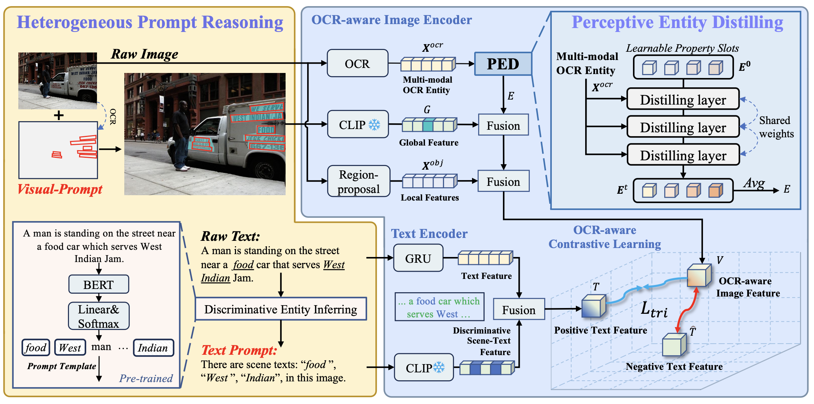
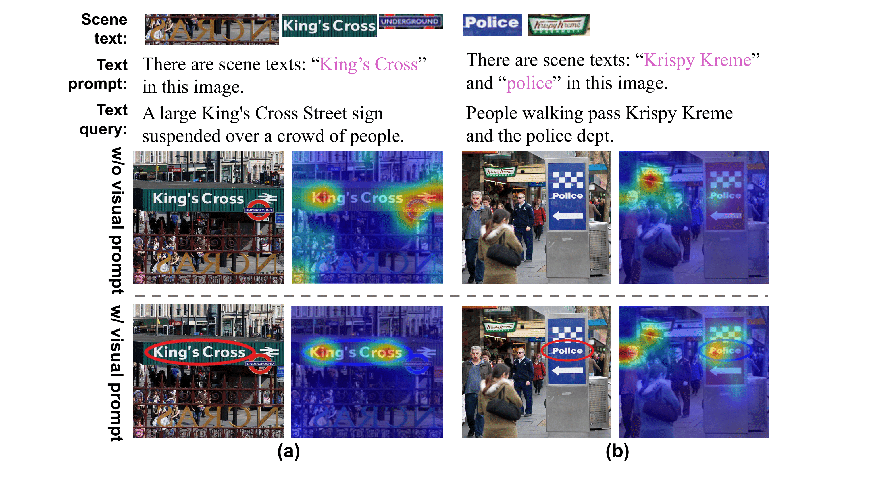
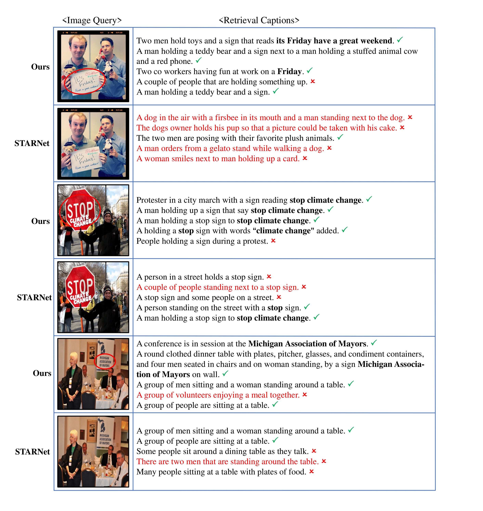
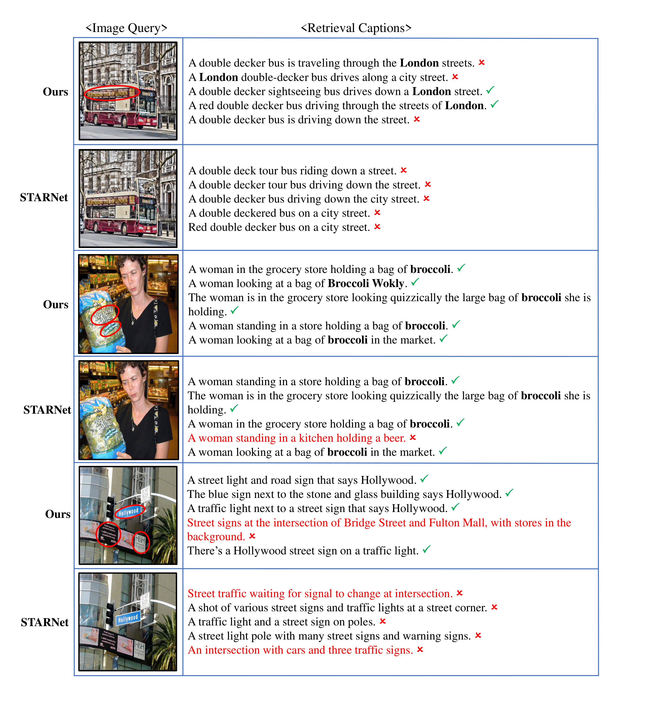

# Heterogeneous Prompt-Guided Entity Inferring and Distilling for Scene-Text Aware Cross-modal Retrieval

## [1/6] Task Introduction

    <figure>
        
    </figure>

<!-- 

    <figure>
        <video controls style="width: 100%;">
            <source src="video.mp4" type="video/mp4">
            Your browser does not support the video tag.
        </video>
    </figure>

 -->

## [2/6] Retrieval Process

    <figure>
        
    </figure>

<!-- 

    <figure>
        <video controls style="width: 100%;">
            <source src="video2.mp4" type="video/mp4">
            Your browser does not support the video tag.
        </video>
    </figure>

 -->

## [3/6] Attention Maps

    <figure>
        
    </figure>

## [4/6] T-SNE Visualization

    <figure>
        
    </figure>

## [5/6] TEXT→IMG Retrieval (1/2) 📄🔍🎆

## [5/6] TEXT→IMG Retrieval (2/2) 📄🔍🎆

## [6/6] IMG→TEXT Retrieval (1/2) 🎆🔍📄

## [6/6] IMG→TEXT Retrieval (2/2) 🎆🔍📄

## Abstract
In cross-modal retrieval, comprehensive image understanding is vital while the scene text in images can provide fine-grained information to understand visual semantics. Current methods fail to make full use of scene text. They suffer from the semantic ambiguity of independent scene text and overlook the heterogeneous concepts in image-caption pairs. In this paper, we propose a heterogeneous prompt-guided entity inferring and distilling (HOPID) network to explore the nature connection of scene text in images and captions and learn a property-centric scene text representation. Specifically, we propose to align scene text in images and captions via heterogeneous prompt, which consists of visual and text prompt. For text prompt, we introduce the discriminative entity inferring module to reason key scene text words from captions, while visual prompt highlights the corresponding scene text in images. Furthermore, to secure a robust scene text representation, we design a perceptive entity distilling module that distills the beneficial information of scene text at a fine-grained level. Extensive experiments show that the proposed method significantly outperforms existing approaches on two public cross-modal retrieval benchmarks. 

