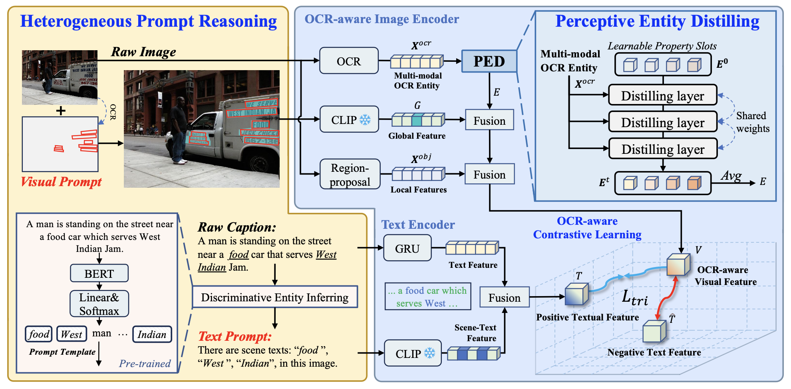
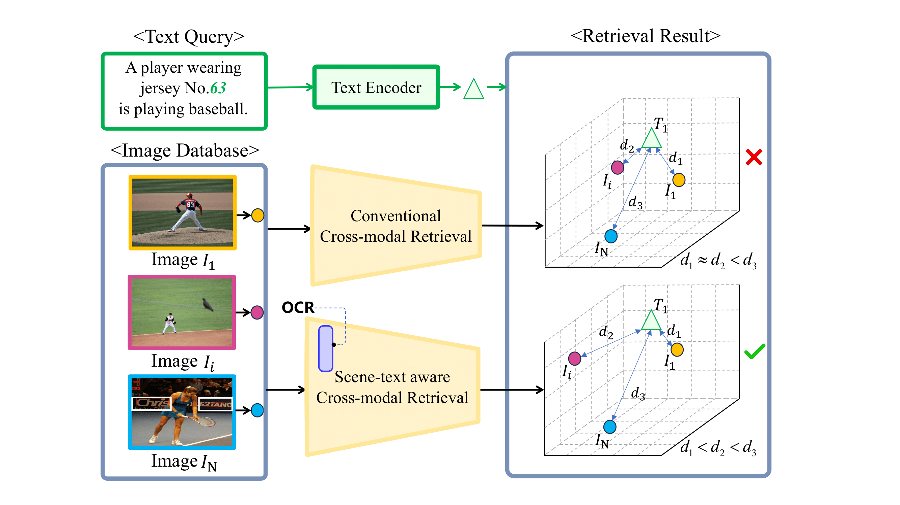
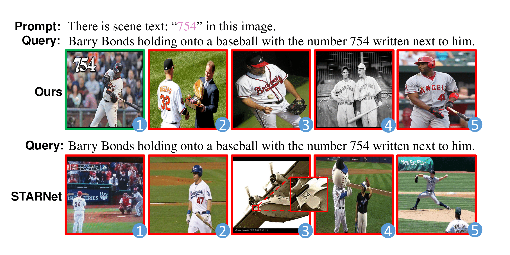
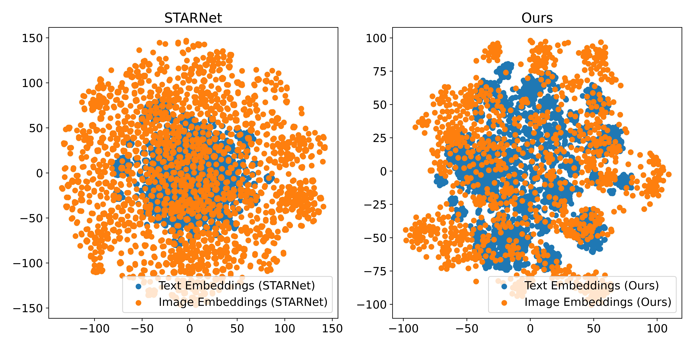

# HOPID: Heterogeneous Prompt-Guided Entity Inferring and Distilling for Scene-Text Aware Cross-modal Retrieval

## Abstract
In cross-modal retrieval, comprehensive image understanding is vital while the scene text in images can provide fine-grained information to understand visual semantics. Recent works try to make full use of scene text, but they still suffer from the semantic ambiguity of independent scene text. To address this issue, we propose a novel heterogeneous prompt-guided entity inferring and distilling network to explore the inherent connection of scene text across different modalities and learn property-centric scene text representation. Specifically, we first introduce the discriminative entity inferring module which infers the discriminative entity words in captions to build text prompt. Then we align these words with the scene text in images to narrow the cross-modal gap via heterogeneous prompt learning. Simultaneously, we enhance the contextual information of scene text by locating them in images through visual prompt to alleviate local noise. Furthermore, to secure a robust scene text representation, we design a perceptive entity distilling module that distills the beneficial information of scene text at a fine-grained level. Extensive experiments show that the proposed method significantly outperforms existing approaches on two public cross-modal retrieval benchmarks.

## Task Introduction

    <figure>
        
        <figcaption>Introduction Image</figcaption>
    </figure>
    <figure>
        
        <figcaption>New Visualization</figcaption>
    </figure>

### Semantic Ambiguity Issue

    <figure>
        
        <figcaption>New Visualization</figcaption>
    </figure>

## Attention Maps

    <figure>
        
        <figcaption>t-SNE Image</figcaption>
    </figure>

## T-SNE Visualization

    <figure>
        
        <figcaption>t-SNE Visualization</figcaption>
    </figure>

## TEXT→IMG Retrieval (1/2) 📄🔍🎆

## TEXT→IMG Retrieval (2/2) 📄🔍🎆

## IMG→TEXT Retrieval (1/2) 🎆🔍📄

## IMG→TEXT Retrieval (2/2) 🎆🔍📄
